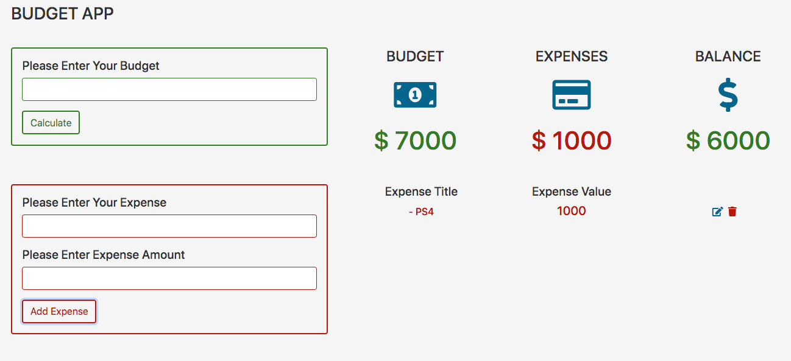

# budget-app

> Code-Along exercise for practice javascript classes, objects, methods and HTML5 events.

## Table of contents
* [General info](#general-info)
* [Screenshots](#screenshots)
* [Technologies](#technologies)
* [Setup](#setup)
* [Features](#features)
* [Status](#status)
* [Inspiration](#inspiration)
* [Contact](#contact)

## General info
The purpose of the project is to be able to build a complete application to manage a budget and expenses list. [development-strategy.md](./development-strategy.md) file contains the steps used to complete this project, it describes the branches with details about the what is implemented.

## Screenshots

## Technologies
* HTML5
* CSS3
* git
* font-awesome library
* Bootstrap
* javascript

## Setup
You can clone or fork this repository and test the files.

## Features
The project features a web site with:
* Ability to add a budget to the application
* Ability to add an expense to the list
* Ability to edit and delete an expense from the list
* Calculate the final balance after any operation

## Status
Project is: finished, final version.

## Inspiration
[`Javascript Project Tutorial: Budget App`](https://www.youtube.com/watch?v=m_HJ3juuFvo) tutorial from freeCodeCamp.

## Contact
Created by [@ferrycosv](www.github.com/ferrycosv) - feel free to contact me!